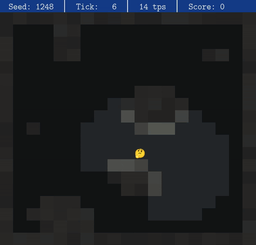

# Signal Quest

Signal Quest ist ein Programmierwettbewerb, der sich an Schülerinnen und Schüler richtet, die ihre Fähigkeiten im Bereich der algorithmischen Problemlösung und Programmierung verbessern möchten. In diesem Wettbewerb programmierst du einen Bot, der sich durch ein Labyrinth bewegt, um möglichst schnell und effizient Beacons zu finden und einzusammeln.

Oben siehst du einen Bot, der zufällig durch das Labyrinth läuft und dabei Beacons einsammelt (leider ist er nicht besonders gut darin). Deine Aufgabe ist es, einen Bot zu programmieren, der intelligenter vorgeht und die Beacons schneller findet.

## Zeitplan

Der Wettbewerb besteht aus mehreren Stufen. Da der Wettbewerb nebenbei zur Schule läuft, sind die Stufen so großzügig bemessen, dass du nebenbei auch noch Zeit für deine schulischen Verpflichtungen hast.

| Beginn | Dauer | Stage | Titel |
|--------|--------|-------|-------|
| 06.10.2025 | 4 Wochen | Stage 0 | **System Check** (optional) |
| 03.11.2025 | 3 Wochen | Stage 1 | **Training Grounds** |
| 24.11.2025 | 3 Wochen | Stage 2 | **Dark Signal** |
| 15.12.2025 | 6 Wochen | Stage 3 | **Resonance** |
| 26.01.2026 | 5 Wochen | Stage 4 | **Signal Array** |
| 02.03.2026 | 4 Wochen | Stage 5 | **Portal Nexus** |
| 30.03.2026 | 4 Wochen | Bonus Stage | **The Swarm** |

In Stage 0 kannst du testen, ob dein Bot korrekt funktioniert und ob du ihn erfolgreich einreichen kannst. Diese Stufe fließt nicht in die Wertung ein, es handelt sich nur um eine optionale Vorbereitungsphase.

## Teilnahme

Die Teilnahme am Wettbewerb ist kostenlos und offen für alle Schülerinnen und Schüler. Wenn du teilnehmen möchtest, schreib eine E-Mail an [signalquest@gymnasiumsteglitz.de](mailto:signalquest@gymnasiumsteglitz.de) mit deinem Namen, deiner Schule und deinem Alter. Du erhältst dann weitere Informationen und Zugang zum Wettbewerb. Du kannst alleine oder im Team teilnehmen. Du kannst auch einsteigen, wenn der Wettbewerb bereits begonnen hat.

## Ablauf des Wettbewerbs

Der Wettbewerb läuft über mehrere Monate. In jeder Stufe hast du Zeit, deinen Bot zu verbessern und neue Strategien zu entwickeln. Während jeder Stage gibt es tägliche Scrims, bei denen du siehst, wie dein Bot im Vergleich zu anderen abschneidet. Am Ende jeder Stufe gibt es ein Finale, bei dem alle Bots gegeneinander antreten und eine Rangliste erstellt wird.

## Wie programmiere ich meinen Bot?

Du kannst deinen Bot in einer  Programmiersprache deiner Wahl programmieren. Dein Bot bekommt in jeder Runde Informationen über seine Umgebung und muss darauf basierend eine Aktion auswählen. Die Informationen, die dein Bot erhält, werden im JSON-Format bereitgestellt. Dein Bot muss diese Informationen verarbeiten und anschließend eine Aktion zurückgeben, z. B. »gehe nach Norden«.

Damit du gleich loslegen kannst, haben wir ein paar Beispiel-Bots in verschiedenen Programmiersprachen vorbereitet, die du als Vorlage verwenden kannst.

## Wie teste ich meinen Bot?

Du kannst deinen Bot lokal auf deinem Computer testen, indem du den bereitsgestellten Runner verwendest. Der Runner simuliert die Spielumgebung und führt deinen Bot aus. Der Runner ist deterministisch und erstellt – abhängig von einem Seed – immer die gleichen Karten. So kannst du deinen Bot immer wieder auf denselben Karten testen und verbessern. Wir verwenden denselben Runner auf dem offiziellen Server, sodass du sicher sein kannst, dass dein Bot dort genauso funktioniert wie lokal.

## Wie reiche ich meinen Bot ein?

Um deinen Bot einzureichen, musst du uns Lesezugriff auf ein Git-Repository geben, in dem sich der Code deines Bots befindet. Du kannst dafür z. B. GitHub, GitLab oder Bitbucket verwenden. Dieses Repository sollte natürlich privat sein, damit niemand deinen Code sehen kann (falls du keine Möglichkeit hast, ein privates Repository anzulegen, bekommst du von uns ein privates Repository, das du verwenden kannst).

Du kannst auf der Wettbewerbsseite deinen Bot registrieren, indem du den Link zu deinem Repository angibst. Danach wird dein Bot automatisch bei jedem Scrim und im Finale ausgeführt und bewertet. Du hast auch die Möglichkeit, einen Branch anzugeben, der verwendet werden soll.